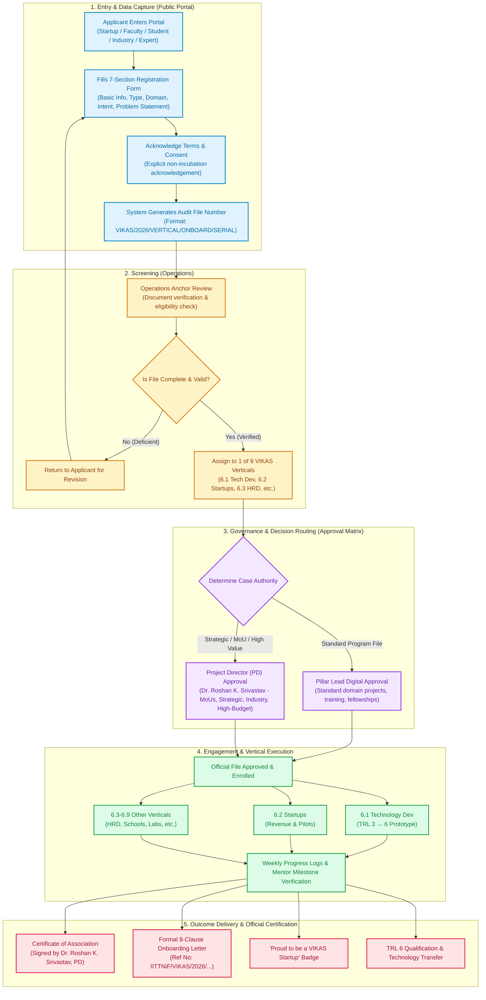
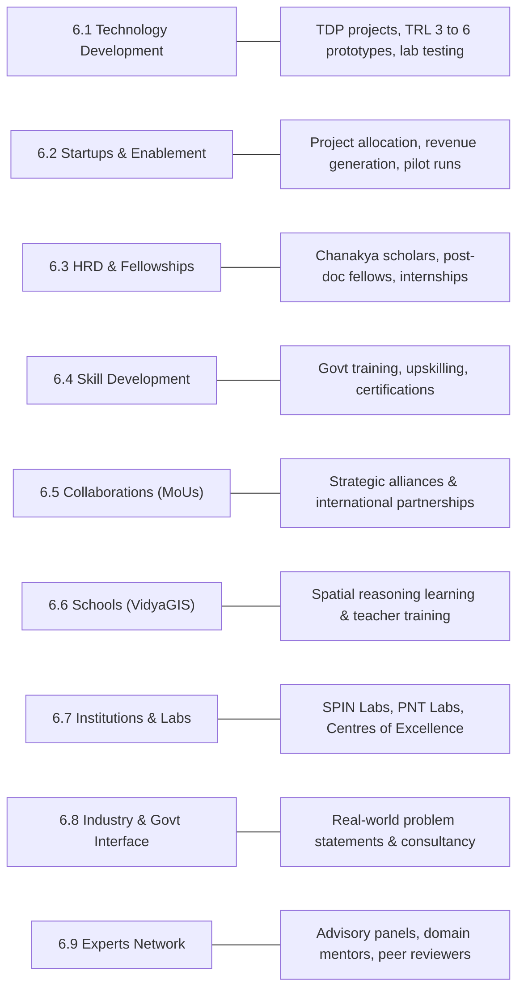
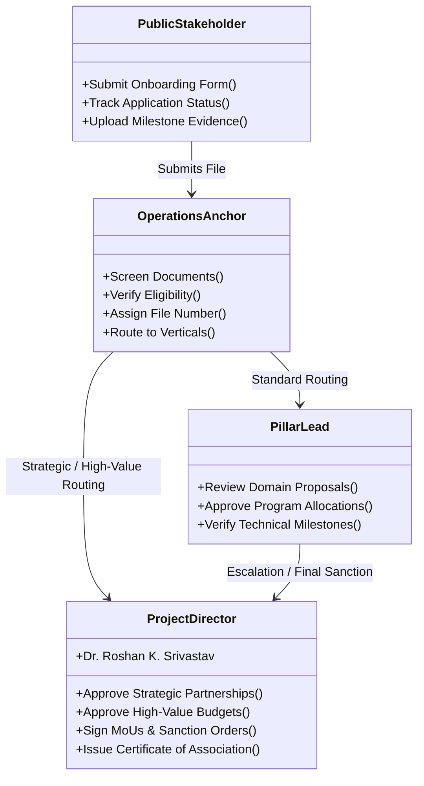

# 🏛️ VIKAS – Single-Window Platform of TIH / IITTNiF

> **IIT Tirupati Navavishkar I-Hub Foundation (IITTNiF)**  
> *Technology Innovation Hub (TIH) on Positioning and Precision Technologies*  
> **Leadership:** Dr. Roshan K. Srivastav, Project Director (PD)

---

## 📌 1. What is the VIKAS Platform?

**VIKAS** is the flagship single-window digital gateway of IITTNiF. It brings together **startups, academic institutions, industry, government departments, schools, and domain experts** into a structured, outcome-driven innovation ecosystem under the National Mission on Interdisciplinary Cyber-Physical Systems (**NM-ICPS**).

> [!IMPORTANT]
> **Core Policy Position:**  
> **VIKAS is NOT an incubation or equity-based program.**  
> It is a **structured engagement, execution, and business enablement platform** that connects talent, technology, and funding to drive real-world deployment.

---

## 🔄 2. End-to-End System Workflow Diagram

---

## 📑 3. Step-by-Step Flow Explanation (Minimal & Clear)

### **Step 1: Stakeholder Entry & Data Capture (Public Portal)**
* **Who does it:** Startups, Faculty, Researchers, Industry, Schools, Experts.
* **Action:** Fills a 7-section single-window registration form:
  1. **Basic Details:** Name, Organization, Email, Phone, Location.
  2. **Stakeholder Type:** Startup, Student/Researcher, School, Institution, Industry, Government, Expert.
  3. **Domain Selection:** GIS/Remote Sensing, NavIC/PNT, AI/ML, Drone Tech, Digital Twin, etc.
  4. **Intent of Engagement:** Skill Dev, Project Participation, Collaboration, Tech Dev, Business.
  5. **Dynamic Details:** Tailored inputs (e.g. Startup stage, Expert experience, Lab requirements).
  6. **Problem Statement:** Open-text project or research proposal.
  7. **Consent:** Agrees to policies and explicitly acknowledges the non-incubation nature.
* **Result:** System assigns a unique digital tracking number (e.g. `VIKAS/2026/STARTUP/ONBOARD/101`).

---

### **Step 2: Administrative Screening (Operations Anchor)**
* **Who does it:** Operations Anchor / Secretariat Cell.
* **Action:**
  * Checks document authenticity, eligibility criteria, and endorsements.
  * Assigns the official vertical category (6.1 to 6.9).
  * Enforces compliance—no file moves forward without a verified digital audit log.

---

### **Step 3: Governance & Approval Matrix**
* **Who does it:** Domain Pillar Leads & Project Director (**Dr. Roshan K. Srivastav**).
* **Decision Rules:**

| Case Type | Approval Authority |
|---|---|
| **General Onboarding** | Automated / Operations Anchor |
| **Program Participation / Fellowships** | **Pillar Lead** *(Domain Head)* |
| **Startup Project Allocation** | **Startups Pillar + Project Director** |
| **Industry / Government Engagement** | **Project Director (PD)** |
| **Senior Expert Onboarding** | **Project Director (PD)** |
| **Strategic MoUs & National Alliances** | **Project Director (PD)** |

---

### **Step 4: Program Engagement & Vertical Execution (The 9 Verticals)**

Once approved, the file transitions into its active vertical:

---

### **Step 5: Execution Monitoring & Outcome Deliverables**
* **Milestone Tracking:** Principal Investigators log weekly progress, evidence files, and test results.
* **Mentor Sign-off:** Domain experts verify deliverables at each milestone.
* **Formal Outputs Issued:**
  1. 📜 **Certificate of Association:** Official certificate signed by **Dr. Roshan K. Srivastav**, Project Director.
  2. 📄 **Formal 8-Clause Onboarding Letter:** Documented reference letter (`IITTNiF/VIKAS/YYYY/____`) specifying Scope, IP, Confidentiality, and Liability terms.
  3. 🏅 **"Proud to be a VIKAS Startup" Badge:** Official branding asset for social media and website inclusion.
  4. 🚀 **TRL 6 Qualification:** Technology prototype validated for commercial transfer or deployment.

---

## 🏛️ 4. System Roles & Responsibilities

---

## 💡 5. How to Explain This to Anyone in 30 Seconds

> *"**VIKAS** is the single-window innovation platform of IIT Tirupati Navavishkar I-Hub Foundation (IITTNiF).  
> Applicants—from startups to researchers—register through a 7-section portal. The Operations team screens and routes their file to one of 9 specialized verticals, where Domain Leads and the Project Director (**Dr. Roshan K. Srivastav**) review and approve them. Once active, the platform tracks weekly progress and mentor milestone verifications until issuing the official **Certificate of Association** and **TRL 6 prototype certification**."*
